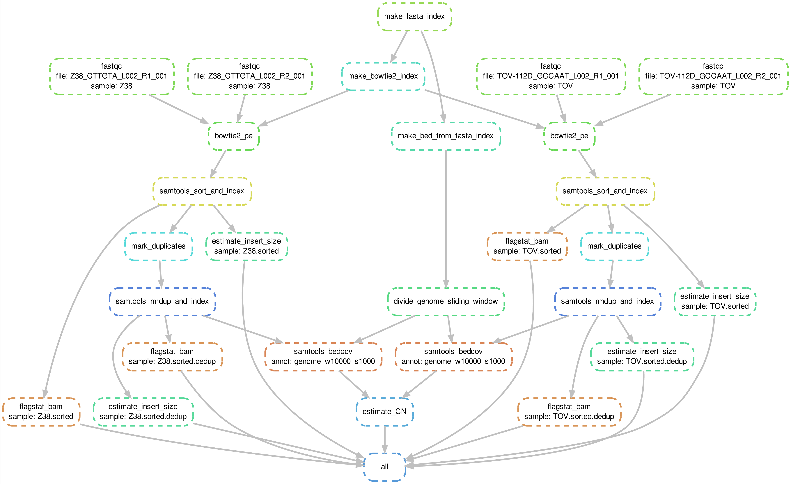
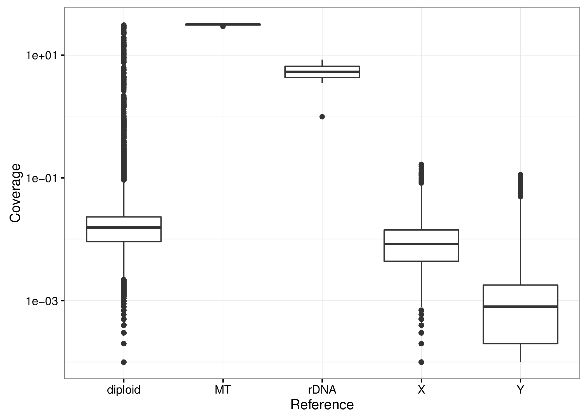

<script type="text/x-mathjax-config">
MathJax.Hub.Config({
  CommonHTML: {
    scale: 130
  }
});
</script>


```{r setup, include=FALSE}
knitr::opts_chunk$set(echo = FALSE);

suppressMessages(library(reshape2));     # For wide to long dataframe conversion
suppressMessages(library(ggplot2));      # For plotting
suppressMessages(library(ggrepel));      # For avoiding overlapping labels in ggplot2
suppressMessages(library(extrafont));    # For hrbrthemes fonts
suppressMessages(library(hrbrthemes));   # For theme_ipsum_rc()
```

## General method 1

We infer ribosomal (rDNA) copy number from a comparison of read coverage across the rDNA repeat and across the diploid autosomal chromosomes.

The rDNA copy number is then given by
<div style="font-size:80%">
$$
\text{CN}(\text{rDNA}) = 2\times\frac{\text{mean coverage}(\text{rDNA})}{\text{mean coverage}(\text{diploid DNA})}\,.
$$
</div>

This is consistent with the approach to estimate mtDNA copy number from whole-genome sequencing data,
<div style="font-size:80%">
$$
\text{CN}(\text{mtDNA}) = 2\times\frac{\text{mean coverage}(\text{mtDNA})}{\text{mean coverage}(\text{diploid DNA})}\,,
$$
</div>
as discussed in [Qian et al., Bioinformatics 33, 1399 (2017)](https://academic.oup.com/bioinformatics/article-lookup/doi/10.1093/bioinformatics/btw835) and [Ding et al., PLoS Genet. 14, e1005306 (2015)](https://www.ncbi.nlm.nih.gov/pubmed/26172475).


## General method 2

We also obtain an estimate for the standard error of the copy number $se(\text{CN})$, which are based on the standard errors of the mean (sem) coverage of rDNA and diploid DNA.

Specifically,
<div style="font-size:80%">
$$
se(\text{CN}) = \text{CN} \times \sqrt{\left(\frac{\text{sem coverage(rDNA)}}{\text{mean coverage(rDNA)}}\right)^2 + \left(\frac{\text{sem coverage(diploid DNA)}}{\text{mean coverage(diploid DNA)}}\right)^2} 
$$
</div>

We assess variability in coverage using a sliding window approach.


## Workflow

<ol start="1">
<li> We construct a repeat-masked reference genome consisting of
    
* all diploid autosomal chromosomes ([Ensembl GRCh38.p10](http://www.ensembl.org/Homo_sapiens/Info/Index)),
* chromosomes X and Y ([Ensembl GRCh38.p10](http://www.ensembl.org/Homo_sapiens/Info/Index)),
* the mitochondrial DNA (mtDNA) ([Ensembl GRCh38.p10](http://www.ensembl.org/Homo_sapiens/Info/Index)), and
* a single sequence copy of the canonical rDNA repeat unit ([U13369.1](https://www.ncbi.nlm.nih.gov/nuccore/555853)).

<li> We perform read alignment for whole genome sequencing data of samples TOV and Z38 against the reference genome.

<li> We use a sliding window approach to estimate sequencing depth (coverage) across (1) the diploid DNA, (2) the rDNA repeat, and (3) the mitochondrial DNA. A sliding window approach is advantageous because it will result in smoothing of regions with large deviations in coverage from uniformity. Here we use a window of width $w = 10\text{ kb}$ and a step size of $s = 1\text{ kb}$.
</ol>


## Workflow -- continued

<ol start="4">
<li> We determine the mean and standard error of the mean coverage of (1) the diploid DNA, (2) the rDNA repeat, and (3) the mtDNA. For example:
<div style="font-size:80%">
$$
\text{mean coverage(rDNA)} = \frac{1}{n}\sum_{i=1}^n \text{coverage(rDNA)}\,,
$$
$$
\text{sem coverage(rDNA)} = \frac{\text{sd coverage(rDNA)}}{\sqrt{n}}\,,
$$
</div>
where $n$ refers to the total number of windows of width $w$ and coverage $>1$.

Note: We discard regions where $\text{coverage} = 0$. This is because we are working with a repeat-masked reference genome, where sequences of regions of repetitive DNA have been replaced with N's. This reduces the mappable reference genome space, and we correct for this effect by removing zero coverage regions.     
</ol>


## Copy number estimates

```{r, echo=FALSE, dev.args = list(bg = "transparent")}
fn <- c(
  "CN_cov_genome_w10000_s1000_TOV_noZeros.RData", 
  "CN_cov_genome_w10000_s1000_Z38_noZeros.RData");
CN <- lapply(fn, function(x) {
  load(x);
  get("ret");
});
names(CN) <- gsub("(CN_cov_genome_w\\d+_s\\d+_|_noZeros|_noZeros|.RData)", "", fn);
# Prepare for plotting
meanCN <- lapply(CN, function(x) x$CN);
df <- melt(meanCN, id.vars = c("what", "mean", "se"));

# Plot
gg <- ggplot(df, aes(x = L1, y = mean));
gg <- gg + geom_bar(stat = "identity");
gg <- gg + geom_errorbar(
    aes(ymin = mean - se, ymax = mean + se),
    width = 0.1);
gg <- gg + geom_text(
    aes(x = L1, y = mean/2, label = paste(round(mean), "\u00B1", round(se))),
    colour = "white");
gg <- gg + facet_wrap(~ what);
gg <- gg + theme_ipsum_rc();
gg <- gg + labs(x = "Sample", y = "CN");
gg <- gg + theme(
    strip.background = element_blank(),
    axis.text.x = element_text(angle = 45, hjust = 1),
    rect = element_rect(fill = "transparent"),
    panel.background = element_rect(fill = "transparent"),
    plot.background = element_rect(fill = "transparent", colour = NA),
    legend.position = "bottom");
gg;
```

## Comparison with fastMitoCalc 1

As an independent validation, we compare estimated mtDNA copy numbers with results from fastMitoCalc.

References:

1. [Qian et al., Bioinformatics 33, 1399 (2017)](https://academic.oup.com/bioinformatics/article-lookup/doi/10.1093/bioinformatics/btw835)
2. [Program website](https://lgsun.irp.nia.nih.gov/hsgu/software/mitoAnalyzer/index.html)

**Results suggest that inferred mtDNAcopy numbers are consistent with copy numbers estimated using existing methods. Consequently, inferred rDNA copy numbers are expected to be reasonable estimates.**


## Comparison with fastMitoCalc 2

```{r echo=FALSE}
df <- cbind.data.frame(
  what = c("fastMitoCalc", "fastMitoCalc", "This work", "This work"),
  L1 = c("TOV", "Z38", "TOV", "Z38"),
  mean = c(1431, 2727, df[df$what == "MT", 2]));
gg <- ggplot(df, aes(x = L1, y = mean));
gg <- gg + geom_bar(stat = "identity");
gg <- gg + geom_text(
    aes(x = L1, y = mean/2, label = round(mean)),
    colour = "white");
gg <- gg + facet_wrap(~ what);
gg <- gg + theme_ipsum_rc();
gg <- gg + labs(x = "Sample", y = "CN");
gg <- gg + theme(
    strip.background = element_blank(),
    axis.text.x = element_text(angle = 45, hjust = 1),
    rect = element_rect(fill = "transparent"),
    panel.background = element_rect(fill = "transparent"),
    plot.background = element_rect(fill = "transparent", colour = NA),
    legend.position = "bottom");
gg;
```


# Appendix

## Analysis workflow 1

The full analysis workflow is maintained on github:

[https://github.com/mevers/CN_WGS](https://github.com/mevers/CN_WGS)

Please contact Maurits Evers [maurits.evers@anu.edu.au](mailto:maurits.evers@anu.edu.au) for access and instructions.


## Summary of snakemake analysis workflow

<p style="margin-top:-1em">  </p>
<center></center>

## Coverage TOV

<p style="margin-top:-1em">  </p>
<center></center>


## Coverage Z38

<p style="margin-top:-1em">  </p>
<center></center>


<!-- ## Copy number estimates (including zero coverage) {-} -->

<!-- ```{r, echo=FALSE, dev.args = list(bg = "transparent")} -->
<!-- fn <- c( -->
<!--   "CN_cov_genome_w10000_s1000_TOV_withZeros.RData",  -->
<!--   "CN_cov_genome_w10000_s1000_Z38_withZeros.RData"); -->
<!-- CN <- lapply(fn, function(x) { -->
<!--   load(x); -->
<!--   get("ret"); -->
<!-- }); -->
<!-- names(CN) <- gsub("(CN_cov_genome_w\\d+_s\\d+_|_noZeros|_withZeros|.RData)", "", fn); -->
<!-- # Prepare for plotting -->
<!-- meanCN <- lapply(CN, function(x) x$CN); -->
<!-- df <- melt(meanCN, id.vars = c("what", "mean", "se")); -->

<!-- # Plot -->
<!-- gg <- ggplot(df, aes(x = L1, y = mean)); -->
<!-- gg <- gg + geom_bar(stat = "identity"); -->
<!-- gg <- gg + geom_errorbar( -->
<!--     aes(ymin = mean - se, ymax = mean + se), -->
<!--     width = 0.1); -->
<!-- gg <- gg + geom_text( -->
<!--     aes(x = L1, y = mean/2, label = paste(round(mean), "\u00B1", round(se))), -->
<!--     colour = "white"); -->
<!-- gg <- gg + facet_wrap(~ what); -->
<!-- gg <- gg + theme_ipsum_rc(); -->
<!-- gg <- gg + labs(x = "Sample", y = "CN"); -->
<!-- gg <- gg + theme( -->
<!--     strip.background = element_blank(), -->
<!--     axis.text.x = element_text(angle = 45, hjust = 1), -->
<!--     rect = element_rect(fill = "transparent"), -->
<!--     panel.background = element_rect(fill = "transparent"), -->
<!--     plot.background = element_rect(fill = "transparent", colour = NA), -->
<!--     legend.position = "bottom"); -->
<!-- gg; -->
<!-- ``` -->


